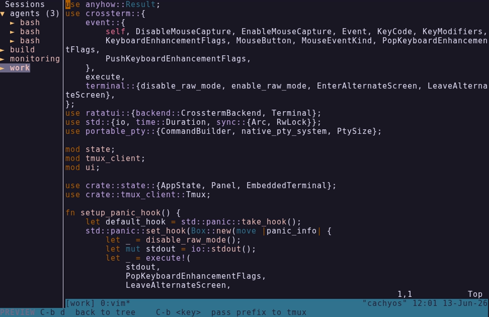

# ttree



A terminal UI for tmux, written in Rust on [Ratatui](https://ratatui.rs). It renders your sessions, windows, and panes as a navigable tree, and embeds a **live preview** of any pane in the right-hand panel. The preview is the point: you can see what a pane is doing without attaching to it.

Built to solve a specific problem: driving many concurrent AI agent sessions running on a laptop from a phone, over Termux and a WireGuard VPN. Switching tmux contexts by hand to check on each one is slow and easy to get wrong. ttree puts every session in one tree and shows live output inline, so a glance replaces a context switch.

## Features

- Tree view of all sessions, windows, and panes, with smart collapsing
- Live pane preview: a real embedded PTY rendered in the right-hand panel
- Click a session in the sidebar to switch the preview, without leaving preview mode
- Persistent UI state (selection, expanded nodes, sidebar width) across restarts, stored in `~/.config/ttree/state.toml`
- Full mouse support: click to select, drag the separator to resize, scroll to navigate
- Drag to select text in the preview and copy it via OSC 52, which works over SSH and through tmux
- Vim-style navigation: `j` / `k` / `h` / `l`
- Create and rename sessions without leaving the TUI
- Real-time sync with tmux every 200ms

## Stack

- **Rust 2021** + Cargo
- [ratatui](https://ratatui.rs): TUI framework
- [tokio](https://tokio.rs): async runtime
- [crossterm](https://docs.rs/crossterm): terminal event handling
- [portable-pty](https://docs.rs/portable-pty): PTY spawning for the live preview
- [vt100](https://docs.rs/vt100) + [tui-term](https://docs.rs/tui-term): VT100 parsing and rendering
- [indexmap](https://docs.rs/indexmap): ordered session, window, and pane collections

## Install

```bash
git clone git@gitlab.com:tek.cat/ttree.git
cd ttree
cargo install --path .
```

The binary lands in `~/.cargo/bin/ttree`. Requires Rust and an active tmux server.

## Usage

Run `ttree` from any terminal, inside or outside tmux.

### Keybindings

| Key | Action |
|-----|--------|
| `j` / `↓` | Move selection down |
| `k` / `↑` | Move selection up |
| `h` / `←` | Collapse node / jump to parent |
| `l` / `→` | Expand node / jump to first child |
| `Space` | Toggle expand/collapse |
| `Enter` | Open live preview panel |
| `a` | Attach to selected session/window/pane |
| `n` | Create new session |
| `r` | Rename selected session |
| `Ctrl+P` | Toggle focus between tree and preview |
| `?` | Help |
| `q` / `Ctrl+C` | Quit |

In preview mode, `Ctrl+B` acts as the tmux prefix (e.g. `Ctrl+B d` to detach and return to the tree).

## Background

ttree began as a Rust rewrite of an earlier personal Python/[Textual](https://textual.textualize.io) prototype for the same workflow. This repository contains the Rust tool only.
